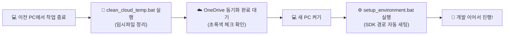

# ☁️ [꽁꽁 출산가방] 멀티 PC 클라우드(OneDrive) 개발 가이드

본 프로젝트는 **OneDrive 클라우드 동기화 폴더** 내에서 여러 대의 컴퓨터를 오가며 개발할 수 있도록 최적화되어 있습니다.

---

## 🚀 빠른 시작 도구 모음

| 파일명 | 기능 및 사용 시점 |
| :--- | :--- |
| **`setup_environment.bat`** | **[필수] 새 컴퓨터에서 작업을 시작할 때 더블 클릭!** 현재 PC의 계정명과 Android SDK 경로를 자동 감지하여 `local.properties`를 자동 설정합니다. |
| **`clean_cloud_temp.bat`** | **[권장] 다른 컴퓨터로 이동하기 전 더블 클릭!** 수만 개의 Gradle 임시 캐시(`.gradle`, `build`)와 충돌 복사본을 정리하여 동기화 잠금을 방지합니다. |
| **`앱_미리보기_실행.bat`** | **[편리] 브라우저에서 즉시 모바일 앱 실행!** Android Studio가 없는 PC에서도 실제 모바일 인터랙션 화면을 브라우저에서 1초 만에 확인합니다. |

---

## 🔄 여러 컴퓨터를 오가며 작업할 때의 권장 워크플로우

### 1단계: 이전 PC에서 작업 마칠 때
1. Android Studio를 종료합니다.
2. 폴더 내 **`clean_cloud_temp.bat`**을 더블 클릭하여 불필요한 빌드 캐시를 지웁니다.
3. 윈도우 작업표시줄의 **OneDrive 아이콘이 "동기화 완료(녹색 체크)"** 상태가 되었는지 확인합니다.

### 2단계: 새로운 PC에서 작업을 시작할 때
1. OneDrive 동기화가 최신 상태인지 확인합니다.
2. 폴더 내 **`setup_environment.bat`**을 더블 클릭합니다.
   - 현재 컴퓨터의 사용자 계정 및 Android SDK 설치 경로를 자동 감지하여 `local.properties`를 현재 PC에 맞게 갱신해 줍니다.
3. **Android Studio**를 열거나, 혹은 **`앱_미리보기_실행.bat`**으로 바로 테스트하며 개발을 이어갑니다.

---

## 📱 현재 앱 구현 완료 현황

1. **로그인 / 온보딩 화면 (`LoginScreen.kt`, `OnboardingSurveyScreen.kt`)**
   - 꽁꽁 공식 마스코트 아이콘 및 감성 UI
   - 비회원 둘러보기 + 카카오/네이버/구글 1초 간편 로그인 디자인
   - 출산예정일(D-Day 계산), 분만형태(제왕/자연), 조리원 여부, 지역 설문
   - 설문 답변에 따른 **스마트 맞춤 추천 알고리즘** 연동 완료

2. **메인 대시보드 (`DashboardScreen.kt`)**
   - 사용자 환영 메시지 및 D-Day 주차 표시 배너
   - 내 가방 바로가기 및 4대 핵심 기능 카드

3. **4대 체크리스트 & 혜택 화면**
   - **출산가방 체크리스트**: 산모용품(30개), 신생아용품(16개), 보호자/공통(21개) 전수 등록 완료 및 담기/체크 기능
   - **육아용품 체크리스트**: 수유/수면/의류/목욕/위생/외출 카테고리별 필수템
   - **시기별 할일 체크리스트**: 임신 초기~출산 후 필수 행정/검진 할일
   - **출산 혜택 모아보기**: 첫만남이용권, 부모급여, 아동수당, 지자체별 출산지원금
   - **내 가방 (`MyBagScreen.kt`)**: 내가 담은 준비물과 혜택 모아보기

4. **웹 인터랙티브 프리뷰 시스템 (`index.html`)**
   - 실제 모바일 폰 뷰포트 내에서 안드로이드 앱과 100% 동일한 화면 전환 및 인터랙션 구현 완료

---

## 📋 다음 개발 작업 추천 (TODO)

- [ ] **체크리스트 상태 영구 저장 (Room DB 또는 DataStore)**: 현재 인메모리(StateFlow)로 작동 중인 체크 상태를 로컬 저장소에 영구 보관
- [ ] **체크리스트 사용자 정의 항목 추가 기능**: 사용자가 직접 원하는 준비물을 추가/삭제할 수 있는 UI
- [ ] **디데이(D-Day) 위젯 및 알림 기능**: 출산 예정일 및 시기별 할일 푸시 알림
- [ ] **엑셀/PDF 내보내기 또는 카카오톡 공유 기능**: 정리한 출산가방 목록을 배우자에게 공유하기
