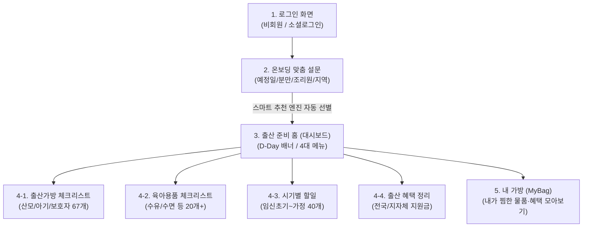

# 📱 [MaternityBag] New Computer Handover & Development Guide

> **Created At**: 2026-09-23  
> **Project**: 꽁꽁 출산가방 (MaternityBag Android App)  
> **Purpose**: Single comprehensive handover manual to transition development from multiple PCs to a **single dedicated main computer**.

※ 본 문서의 한글 정식 명칭 파일은 [`새_컴퓨터_이전_및_작업인수인계_가이드.md`](새_컴퓨터_이전_및_작업인수인계_가이드.md) 입니다. 두 파일은 동일한 내용을 담고 있습니다.

---

## 📌 1. 프로젝트 기본 정보 및 기술 스택

| 구분 | 사양 및 기술 스택 |
| :--- | :--- |
| **앱 명칭** | **꽁꽁 출산가방** (안드로이드 출산 준비물 & 맞춤 체크리스트 어플) |
| **개발 언어** | **Kotlin 2.3.20** |
| **UI 프레임워크** | **Jetpack Compose (Material 3)**, Compose BOM 2026.03.01 |
| **네비게이션** | **AndroidX Navigation3 (1.0.1)** |
| **타깃 SDK** | **Target SDK: 36 (Android 16)**, **Min SDK: 24 (Android 7.0 이상 지원)** |
| **빌드 툴** | Gradle 9.0.1, Java(JDK) 17 Toolchain |
| **디자인 콘셉트** | 따뜻한 피치 코랄 톤 (`#FF6F59`, `#FFF9F6`), 꽁꽁 마스코트 가방 아이콘 |

---

## 📱 2. 지금까지 완성된 앱 기능 및 화면 구조

### 주요 화면 및 기능 요약:
1. **로그인 (`LoginScreen.kt`)**: 꽁꽁 아이콘, 비회원 둘러보기, 카카오/네이버/구글 1초 간편가입 디자인
2. **온보딩 맞춤 설문 (`OnboardingSurveyScreen.kt`)**: D-Day 계산, 분만/조리원/지역 맞춤 추천 알고리즘 (`UserProfileRepository`)
3. **홈 대시보드 (`DashboardScreen.kt`)**: D-Day 배너 및 4대 기능 퀵 링크
4. **4대 체크리스트**:
   - **출산가방**: 산모 30개, 아기 16개, 보호자 21개 전수 등록 및 맘카페 1위/추천 팝업(`TopSheetRecommendation.kt`)
   - **육아용품**: 수유/수면 카테고리별 당근/새제품 태그
   - **시기별 할일**: 출산 전~가정 복귀 40개 할일 (#아빠/#엄마/#부부)
   - **출산 혜택**: 첫만남이용권, 부모급여 등 전국/지자체 지원금
5. **내 가방 (`MyBagScreen.kt`)**: 내가 담은 물품 & 혜택 모아보기

---

## ⚡ 3. 구글 스프레드시트 & 주간 자동화 파이프라인

- **`출산준비물_통합데이터.xlsx`**: 4개 시트 마스터 엑셀 (구글 드라이브 업로드 시 즉시 구글 스프레드시트 호환)
- **`google_apps_script.js`**: 컴퓨터가 꺼져 있어도 매주 월요일 08:00에 구글 서버가 맘카페 1위 + 쿠팡 TOP 1~3위를 자동 수집하여 노란색으로 하이라이트. 확인 후 `[어플에 갱신/반영하기]` 버튼 클릭 시 실시간 배포
- **`시트_데이터_동기화.bat`**: 엑셀/시트 수정 내용을 프로젝트 데이터(`data_export.json`)로 즉시 동기화

---

## 🛠️ 4. 새로운 컴퓨터에서 바로 개발 시작하는 4단계

1. **Android Studio 설치** (새 컴퓨터에 없을 경우 공식 사이트에서 설치)
2. **`setup_environment.bat` 더블 클릭**: 새 컴퓨터의 Android SDK 경로를 자동 감지하여 `local.properties`를 자동 갱신합니다.
3. **Android Studio 실행 ➔ [Open] ➔ `출산준비물어플` 폴더 선택**: Gradle 동기화 후 실행(`Shift + F10`)
4. **브라우저 초고속 프리뷰**: `앱_미리보기_실행.bat` 더블 클릭 시 브라우저에서 실제 모바일 화면을 1초 만에 실행

---

## 📂 5. 주요 파일 맵

- `setup_environment.bat` : [필수] 새 컴퓨터 환경 자동 설정
- `clean_cloud_temp.bat` : 빌드 임시파일 캐시 청소
- `앱_미리보기_실행.bat` : 브라우저 모바일 웹 프리뷰
- `시트_데이터_동기화.bat` : 엑셀 데이터를 앱으로 동기화
- `출산준비물_통합데이터.xlsx` : 4개 시트 통합 엑셀 마스터
- `google_apps_script.js` : 구글 시트 주간 자동 수집 스크립트
- `구글시트_연동_가이드.md` : 구글 시트 연동 상세 매뉴얼
- `app/src/main/java/com/example/maternitybag/` : 안드로이드 Compose 소스 코드
