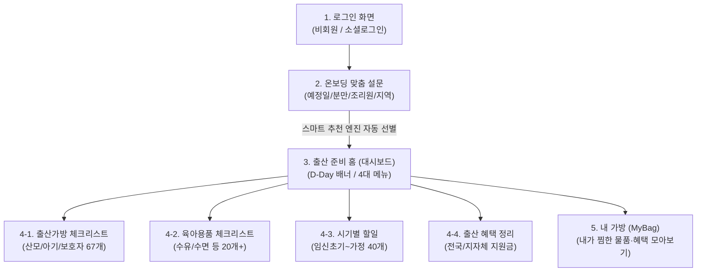

# 📱 [꽁꽁 출산가방] 새로운 메인 컴퓨터 이전 및 개발 인수인계 총정리 가이드

> **작성 일시**: 2026-09-23  
> **프로젝트명**: 꽁꽁 출산가방 (MaternityBag)  
> **문서 목적**: 여러 대의 컴퓨터에서 분산 작업하던 프로젝트를 **"하나의 메인 컴퓨터"로 단일화/고정**할 때, 지금까지 개발된 모든 기능, 데이터 구조, 자동화 시스템, 그리고 새 컴퓨터 세팅 방법을 완벽하게 이해하고 즉시 이어서 개발할 수 있도록 인수인계합니다.

---

## 📌 1. 프로젝트 기본 정보 및 기술 스택

| 구분 | 사양 및 기술 스택 |
| :--- | :--- |
| **앱 명칭** | **꽁꽁 출산가방** (안드로이드 출산 준비물 & 맞춤 체크리스트 어플) |
| **개발 언어** | **Kotlin 2.3.20** (최신 안정화 버전) |
| **UI 프레임워크** | **Jetpack Compose (Material 3)**, Compose BOM 2026.03.01 |
| **네비게이션** | **AndroidX Navigation3 (1.0.1)** (단일 액티비티 스택 기반) |
| **타깃 SDK** | **Target SDK: 36 (Android 16)**, **Min SDK: 24 (Android 7.0 이상 지원)** |
| **빌드 툴** | Gradle 9.0.1, Java(JDK) 17 Toolchain |
| **디자인 콘셉트** | 따뜻한 피치 코랄 톤 (`#FF6F59`, `#FFF9F6`), 꽁꽁 마스코트 가방 아이콘 |

---

## 📱 2. 지금까지 완성된 앱 기능 및 화면 구조

앱은 **단일 액티비티(`MainActivity.kt`)** 기반으로 **Navigation3**를 통해 화면이 매끄럽게 전환됩니다:



### ① 로그인 화면 (`app/.../ui/login/LoginScreen.kt`)
- 꽁꽁 공식 마스코트 아이콘 및 감성 슬로건 배치
- **[👶 비회원으로 이용하기]** 버튼: 클릭 시 온보딩 설문으로 즉시 진입 (비회원 시 정보 미저장 안내 경고문구 포함)
- **카카오 / 네이버 / 구글 1초 간편 로그인** 원형 버튼 디자인 및 세션 연동 준비 완료

### ② 온보딩 맞춤 설문조사 (`app/.../ui/onboarding/OnboardingSurveyScreen.kt`)
- 출산예정일(DatePicker), 분만형태(자연분만/제왕절개), 조리원 이용 여부(이용함/안함), 거주 지역(서울, 경기, 부산 등) 입력
- **스마트 추천 엔진 (`UserProfileRepository.applySmartRecommendations`)**:
  - 제왕절개 선택 시: 산후복대, 흉터관리 겔, 입는 안심팬티 자동 우선 체크
  - 자연분만 선택 시: 회음부 방석, 좌욕판, 마이비데 자동 우선 체크
  - 조리원 이용 시: 수유패드, 모유저장팩, 유축 깔때기, 젖병세제 자동 체크
  - 선택한 지역에 따라 해당 지자체 출산지원금 자동 담기

### ③ 메인 대시보드 (`app/.../ui/dashboard/DashboardScreen.kt`)
- 상단: 사용자 맞춤 D-Day 및 임신 주차 자동 계산 카드 배너
- 중단: **[내 가방 확인하기]** 퀵 버튼 (담아둔 준비물 수 표시)
- 하단: **4대 핵심 기능 카드 버튼** (출산가방, 육아용품, 시기별할일, 출산혜택)

### ④ 4대 체크리스트 & 혜택 화면
1. **출산가방 체크리스트 (`MaternityBagChecklistScreens.kt`)**:
   - 3개 탭: `산모 용품(30개)`, `신생아 용품(16개)`, `보호자 & 공통(21개)` 전수 데이터 등록 완료
   - 장소별 필터(`#병원`, `#조리원`, `#퇴원퇴소`), 품목 검색 기능
   - 각 품목 터치 시 **`TopSheetRecommendation.kt`**가 상단에서 내려오며 **맘카페 1위 언급 브랜드 및 선배맘 추천 TOP 1~3위 상품/가격/구매링크**를 팝업으로 제공
2. **육아용품 체크리스트 (`BabySuppliesChecklistScreens.kt`)**:
   - 먹이기(수유), 재우기(수면), 입히기, 씻기기 카테고리별 목록
   - `#새제품` vs `#당근(중고)` 추천 태그 제공
3. **시기별 할일 체크리스트 (`TodoChecklistScreens.kt`)**:
   - 출산 전 준비기, 병원 입원기, 조리원 회복기, 가정 복귀기 4단계 40개 항목
   - 담당 역할 태그 제공 (`#아빠`, `#엄마`, `#부부`)
4. **출산 혜택 정리 (`BenefitsScreens.kt`)**:
   - 전국 공통(첫만남이용권, 부모급여, 아동수당, 전기세 감면 등)
   - 지자체별 출산지원금(서울 100만, 경기 50만, 인천 1억 아이드림 등)

### ⑤ 내 가방 (`MyBagScreen.kt`)
- 체크리스트에서 내가 '담기'한 물품들과 저장한 출산 혜택들만 한곳에 모아서 보는 최종 확인 페이지

---

## ⚡ 3. 최근 추가된 구글 스프레드시트 & 주간 자동화 파이프라인

선생님께서 코딩 없이 직접 엑셀로 데이터를 수정하고, 컴퓨터가 알아서 최신 인기상품을 채우도록 만든 시스템입니다:

```
[구글 스프레드시트 (온라인 엑셀)]
       │
       ├─ 매주 월요일 08:00 : 구글 클라우드가 맘카페 1위 & 쿠팡 TOP3 자동 수집
       │                      (새로 찾은 행은 '노란색'으로 표시)
       │
       ├─ 선생님 검토 : 스마트폰이나 PC로 확인 후 원하는 대로 수정
       │
       └─ [🚀 어플에 갱신/반영하기] 버튼 클릭!
              │
              ▼
   안드로이드 앱 & 웹 프리뷰에 즉시 최신 내용 반영!
```

- **`출산준비물_통합데이터.xlsx`**: 4개 시트(`출산가방`, `육아용품`, `시기별할일`, `출산혜택`)가 완벽한 표 서식으로 구성된 마스터 엑셀 파일 (구글 드라이브에 올리면 즉시 구글 스프레드시트가 됨).
- **`google_apps_script.js`**: 구글 스프레드시트에 심는 자동화 코드. 컴퓨터가 꺼져 있어도 매주 월요일 08:00에 실행되며, 스프레드시트 상단에 `[🍼 꽁꽁 출산가방 관리]` 메뉴를 만들어 줍니다.
- **`data_export.json`**: 앱과 웹 프리뷰가 공유하는 마스터 데이터베이스 JSON.
- **`시트_데이터_동기화.bat`**: 엑셀에서 수정한 내용을 로컬 프로젝트 파일에 원클릭으로 반영하는 배치 파일.

---

## 📂 4. 프로젝트 폴더 구조 및 파일 맵

새 컴퓨터에서 탐색기를 열었을 때 어떤 파일이 무슨 역할을 하는지 한눈에 파악할 수 있는 맵입니다:

```
출산준비물어플/
│
├── 🚀 [원클릭 실행 및 협업 도구]
│   ├── setup_environment.bat   # [필수] 새 컴퓨터 세팅 시 1번 실행 (SDK 경로 자동 감지)
│   ├── setup_environment.ps1   # 위 배치 파일의 실제 파워쉘 로직
│   ├── clean_cloud_temp.bat    # 빌드 캐시(.gradle, build) 정리 (용량 절약 및 충돌 방지)
│   ├── 앱_미리보기_실행.bat     # 브라우저에서 1초 만에 실제 모바일 앱 구동
│   └── 시트_데이터_동기화.bat   # 엑셀/시트 데이터를 프로젝트로 동기화
│
├── 📊 [데이터 및 스프레드시트 연동 파일]
│   ├── 출산준비물_통합데이터.xlsx # 4개 시트 마스터 엑셀 파일
│   ├── data_export.json        # 4대 기능 전체 데이터베이스 JSON
│   ├── google_apps_script.js   # 구글 시트에 붙여넣는 클라우드 자동 수집 스크립트
│   └── generate_excel.ps1      # 엑셀 생성 스크립트
│
├── 📖 [가이드 문서]
│   ├── 새_컴퓨터_이전_및_작업인수인계_가이드.md # [현재 문서] 전체 인수인계서
│   ├── 구글시트_연동_가이드.md  # 구글 시트 연동 5단계 상세 설명서
│   ├── MULTI_PC_GUIDE.md       # 멀티 PC 동기화 가이드
│   └── README.md               # 프로젝트 기본 설명서
│
├── 🌐 [웹 프리뷰 시스템]
│   ├── index.html              # 브라우저에서 동작하는 독립형 모바일 인터랙티브 앱
│   └── preview/                # 프리뷰 리소스 및 아이콘
│
└── 📱 [안드로이드 네이티브 소스 코드 (app/)]
    └── app/src/main/
        ├── AndroidManifest.xml # 앱 권한 및 액티비티 설정
        ├── java/com/example/maternitybag/
        │   ├── MainActivity.kt # 진입점 액티비티
        │   ├── Navigation.kt   # 전체 화면 라우팅 (Navigation3)
        │   ├── NavigationKeys.kt # 화면 키 정의
        │   ├── data/           # 데이터 모델 및 Repository (StateFlow 기반)
        │   │   ├── MaternityBagData.kt   # 출산가방 품목 데이터
        │   │   ├── BabySuppliesData.kt   # 육아용품 품목 데이터
        │   │   ├── TodoData.kt           # 시기별 할일 데이터
        │   │   ├── BenefitsData.kt       # 출산 혜택 데이터
        │   │   ├── RecommendationData.kt # 맘카페 1위/추천 TOP3 DB
        │   │   └── UserProfile.kt        # 사용자 프로필 & 스마트 추천 알고리즘
        │   ├── ui/             # 화면 UI 컴포넌트 (Compose)
        │   │   ├── login/      # 로그인 화면
        │   │   ├── onboarding/ # 온보딩 맞춤 설문 화면
        │   │   ├── dashboard/  # 홈 대시보드 화면
        │   │   ├── checklist/  # 출산가방, 육아용품, 할일 화면
        │   │   ├── benefits/   # 전국/지자체 혜택 화면
        │   │   ├── mybag/      # 내 가방 화면
        │   │   └── components/ # 상단 팝업(TopSheetRecommendation) 등
        │   └── theme/          # 색상(피치), 폰트, 테마 정의
        └── res/                # 아이콘(ic_ggong_bag), 텍스트(strings.xml) 리소스
```

---

## 🛠️ 5. 새로운 메인 컴퓨터에 세팅하고 개발 시작하는 4단계 방법

새로운 메인 컴퓨터에 앉으셨을 때 아래 순서대로만 진행하시면 5분 만에 세팅이 끝납니다:

### [1단계] 개발 필수 프로그램 설치 (새 컴퓨터에 없을 경우)
1. **Android Studio** 최신 버전(Ladybug 이상 권장) 설치: [공식 다운로드](https://developer.android.com/studio)
   - 설치 과정 중 "Android SDK", "Android SDK Platform", "Virtual Device(에뮬레이터)"를 기본값으로 설치합니다.
2. **Java 17**: Android Studio에 자체 내장되어 있으므로 별도 설치하지 않아도 됩니다.

### [2단계] 환경 자동 감지 스크립트 실행 (가장 중요!)
1. 새 컴퓨터에서 본 프로젝트 폴더(`출산준비물어플`)를 엽니다.
2. 폴더 내 **`setup_environment.bat`** 파일을 더블 클릭합니다.
   - 새 컴퓨터의 사용자 계정명과 Android SDK 위치(`C:\Users\<새계정>\AppData\Local\Android\Sdk`)를 자동으로 찾아 `local.properties`를 새 컴퓨터 환경에 딱 맞게 자동 세팅해 줍니다.

### [3단계] Android Studio에서 프로젝트 열기
1. Android Studio를 실행합니다.
2. 첫 화면에서 **[Open]**을 클릭하고, 본 폴더(`출산준비물어플`)를 선택합니다.
3. 우측 하단에서 Gradle Sync(동기화)가 진행되며 필요한 라이브러리를 자동으로 다운로드합니다. (최초 1~2분 소요)
4. 상단의 실행 버튼(`▶` 또는 `Shift + F10`)을 누르면 에뮬레이터 또는 연결된 스마트폰에서 앱이 실행됩니다!

### [4단계] 브라우저 웹 프리뷰로 초고속 확인 (선택 사항)
- Android Studio를 켜지 않고도 화면 디자인이나 인터랙션을 보고 싶으실 때는, 폴더 내 **`앱_미리보기_실행.bat`**을 더블 클릭하시면 크롬/엣지 브라우저에서 실제 스마트폰 모양으로 앱이 즉시 실행됩니다.

---

## ⚠️ 6. 발생 가능한 문제 및 해결법 (FAQ)

### Q1. Android Studio에서 "SDK location not found" 오류가 나요.
- **원인**: 이전 컴퓨터의 SDK 경로가 남아있기 때문입니다.
- **해결**: 프로젝트 폴더에서 **`setup_environment.bat`**을 더블 클릭해 한 번만 실행해 주시면 즉시 해결됩니다.

### Q2. 새 컴퓨터로 완전히 고정했으니 원드라이브 동기화를 끊거나 일반 폴더로 옮겨도 되나요?
- **답변**: **네, 완전히 가능합니다!**
  - 이제 여러 컴퓨터를 오가지 않고 하나의 컴퓨터에서만 작업하실 예정이라면, 이 폴더를 바탕화면이나 `C:\Projects\출산준비물어플` 같은 일반 로컬 드라이브로 복사/이동해서 작업하시는 것을 오히려 강력 추천합니다.
  - 원드라이브 동기화 부하가 사라져 빌드 속도가 2~3배 빨라집니다.

### Q3. 엑셀에서 품목명을 고쳤는데 앱에 어떻게 반영하나요?
- **답변**:
  - `출산준비물_통합데이터.xlsx` 파일을 엑셀로 열어 수정한 뒤 저장합니다.
  - 폴더 내 **`시트_데이터_동기화.bat`**을 더블 클릭하면 1초 만에 프로젝트 데이터(`data_export.json`)로 동기화됩니다.
  - 구글 스프레드시트 온라인을 사용하실 때는 상단 메뉴의 `[🍼 꽁꽁 출산가방 관리] -> [최신 데이터를 어플에 갱신/반영하기]`를 누르시면 됩니다.

---

## 📋 7. 앞으로 이어서 개발하면 좋은 다음 로드맵 (TODO)

선생님께서 새 컴퓨터에서 다음 단계로 발전시키기 좋은 추천 작업 목록입니다:

1. **로컬 데이터 영구 저장 (Room DB 또는 DataStore)**
   - 현재 체크리스트의 체크 여부(V 표시)는 메모리(`StateFlow`)에 저장되어 앱을 완전히 껐다 켜면 초기화됩니다. 이를 폰 내부 DB에 저장하여 앱을 재실행해도 유지되도록 구현.
2. **나만의 준비물 직접 추가/삭제 UI (+버튼)**
   - 기본 제공 품목 외에 사용자가 직접 텍스트를 입력해 새로운 준비물을 등록할 수 있는 기능.
3. **가족/배우자 카카오톡 공유 기능**
   - 내가 챙긴 출산가방 목록을 남편/배우자에게 카카오톡 텍스트나 링크로 한 번에 공유하는 기능.
4. **출산 D-Day 스마트폰 홈 화면 위젯**
   - 폰 바탕화면에 아기 탄생일까지 남은 디데이와 이번 주 필수 준비물을 띄워주는 안드로이드 위젯(Glance).
